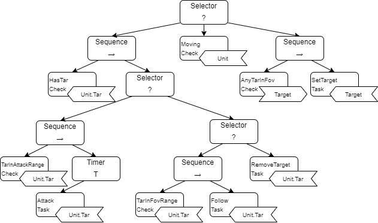

# 烽火 | Design Document

## Unit

Unit 单位。

允许某位控制角色选择的物体。

## Character

Character 人物。

可移动的单位。

### Character Behaviour Tree

## Building

Building 建筑。

不可移动的单位。

## Collectivity

Collectivity 集体。

一个单位集合。

### Collectivity Behaviour Tree
